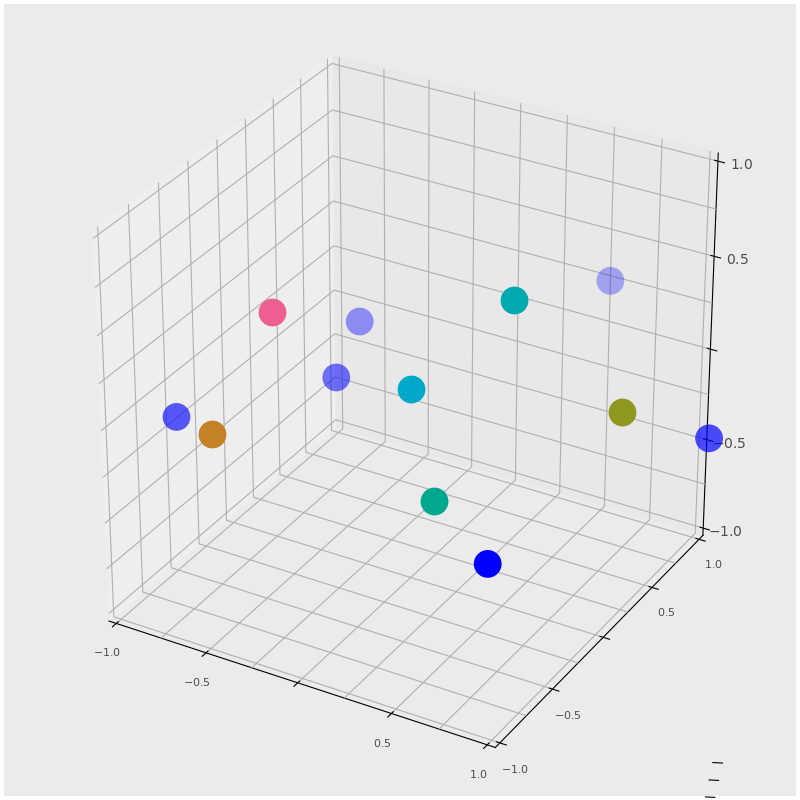
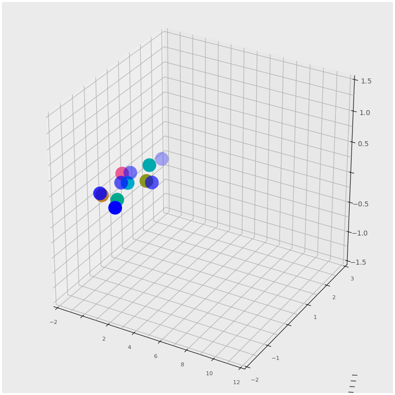
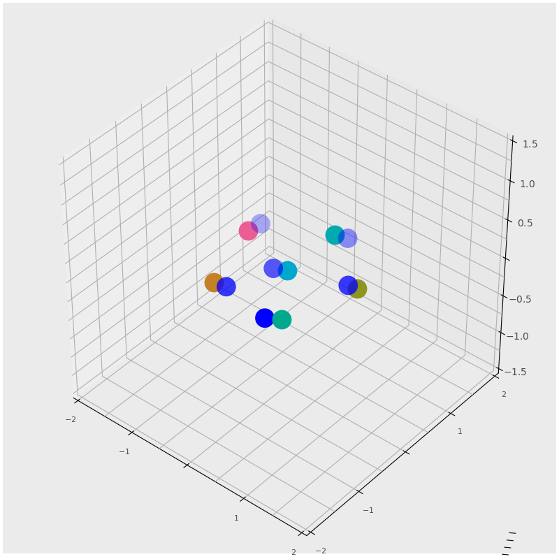
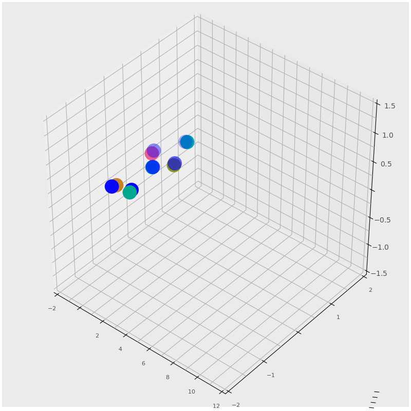

## Formation-Control-of-multi-agents-system-using-Graph-rigidity

Formation control of the agents having single integrator dynamics

Formation tracking a given trajectory (Single integrator model)

Formation control of the agents having single integrator dynamics

Formation tracking a given trajectory (Single integrator model)

