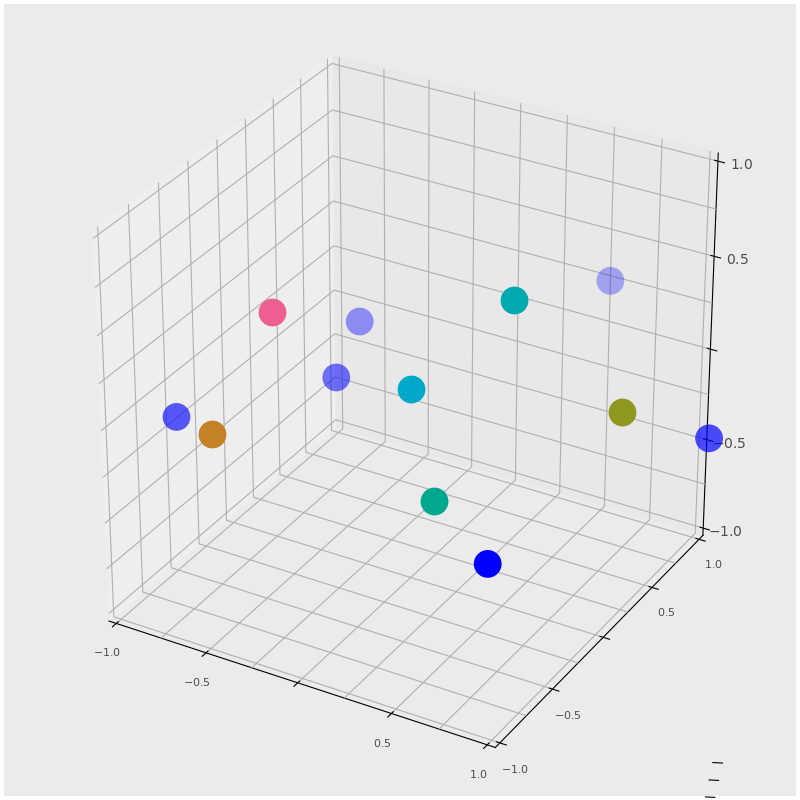
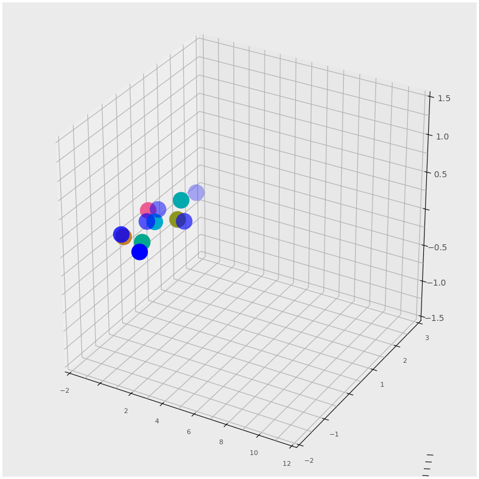
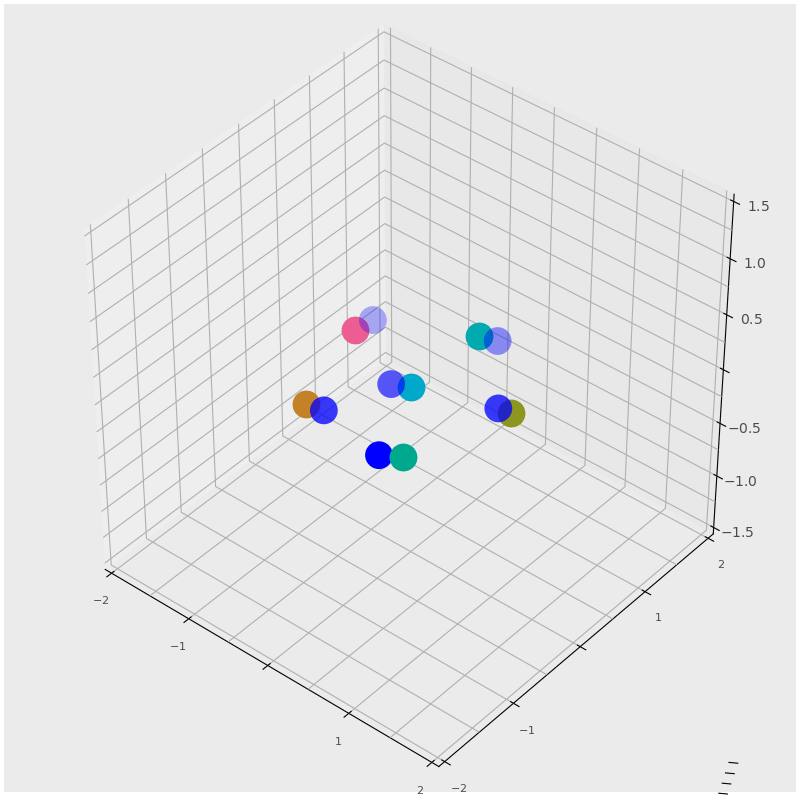
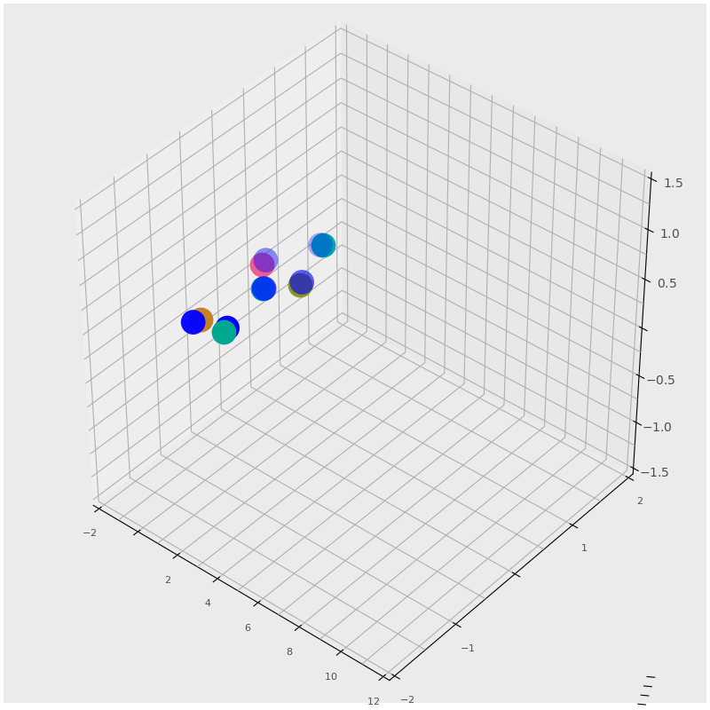

## Formation-Control-of-multi-agents-system-using-Graph-rigidity

Formation control of the agents having single integrator dynamics

Formation tracking a given trajectory (Single integrator model)

Formation control of the agents having Double integrator dynamics

Formation tracking a given trajectory (Double integrator model)

The simulations are from the following resource,
Formation Control of Multi-Agent Systems: A Graph Rigidity Approach

https://www.wiley.com/en-us/Formation+Control+of+Multi+Agent+Systems%3A+A+Graph+Rigidity+Approach-p-9781118887448